# Architecture Documentation

Complete architectural overview of the Full-Stack React + Node.js template project.

## Table of Contents

- [Overview](#overview)
- [System Architecture](#system-architecture)
- [Backend Architecture](#backend-architecture)
- [Frontend Architecture](#frontend-architecture)
- [Technology Stack](#technology-stack)
- [Data Flow](#data-flow)
- [Security Architecture](#security-architecture)
- [Authentication Flow](#authentication-flow)
- [Real-Time Communication](#real-time-communication)
- [Testing Architecture](#testing-architecture)
- [Design Patterns](#design-patterns)
- [Deployment Architecture](#deployment-architecture)

---

## Overview

This is a modern full-stack web application template built with industry-standard technologies and best practices. The architecture follows the **separation of concerns** principle with a clear distinction between frontend presentation layer, backend business logic, and data persistence layer.

### Key Architectural Principles

- **Modular Design**: Code organized into reusable, maintainable modules
- **Separation of Concerns**: Clear boundaries between layers
- **Scalability**: Horizontal and vertical scaling capabilities
- **Security First**: JWT authentication, input validation, rate limiting
- **Developer Experience**: Hot reload, linting, testing frameworks
- **Production Ready**: Error handling, logging, monitoring support

---

## System Architecture

### High-Level Architecture

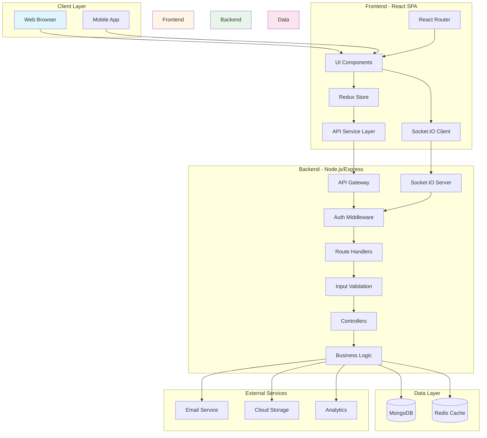

### Component Interaction Flow

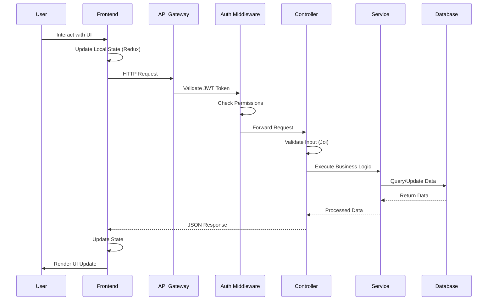

---

## Backend Architecture

### Layered Architecture

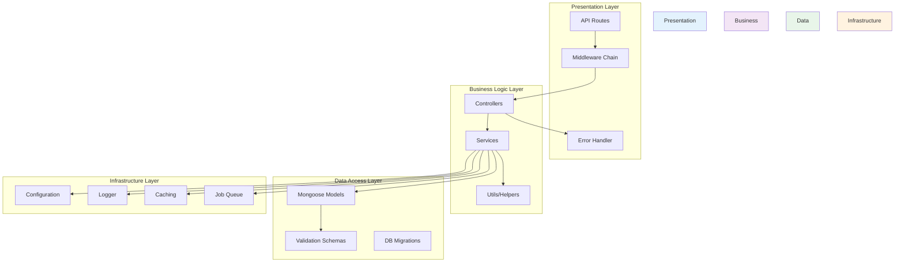

### Directory Structure Explained

```
backend/
├── src/
│   ├── server.js              # Application entry point
│   │                          # - Express app initialization
│   │                          # - Middleware setup
│   │                          # - Route mounting
│   │                          # - Database connection
│   │                          # - Socket.IO initialization
│   │
│   ├── config/                # Configuration management
│   │   ├── index.js           # - Environment variables
│   │   │                      # - App settings
│   │   │                      # - Feature flags
│   │   └── database.js        # - MongoDB connection
│   │                          # - Connection pooling
│   │                          # - Error handling
│   │
│   ├── models/                # Data models (Mongoose schemas)
│   │   └── User.model.js      # - User schema definition
│   │                          # - Virtual fields
│   │                          # - Instance methods
│   │                          # - Static methods
│   │                          # - Pre/post hooks
│   │                          # - Indexes
│   │
│   ├── controllers/           # Request handlers
│   │   ├── auth.controller.js # - Register/Login/Logout
│   │   │                      # - Token refresh
│   │   │                      # - Password management
│   │   └── user.controller.js # - CRUD operations
│   │                          # - Profile management
│   │                          # - Business logic orchestration
│   │
│   ├── routes/                # API route definitions
│   │   ├── index.js           # - Central route aggregation
│   │   ├── auth.routes.js     # - Auth endpoints
│   │   ├── user.routes.js     # - User endpoints
│   │   └── health.routes.js   # - Health check endpoints
│   │
│   ├── middleware/            # Express middleware
│   │   ├── auth.middleware.js       # - JWT verification
│   │   │                            # - User extraction
│   │   │                            # - Role validation
│   │   ├── errorHandler.js          # - Global error handling
│   │   │                            # - Error formatting
│   │   │                            # - Error logging
│   │   ├── validation.middleware.js # - Request validation
│   │   │                            # - Joi schema validation
│   │   ├── rateLimiter.middleware.js# - Rate limiting
│   │   │                            # - DDoS protection
│   │   └── requestLogger.js         # - Request logging
│   │                                # - Performance monitoring
│   │
│   ├── validations/           # Joi validation schemas
│   │   ├── auth.validation.js # - Register validation
│   │   │                      # - Login validation
│   │   └── user.validation.js # - Update validation
│   │                          # - Query validation
│   │
│   ├── utils/                 # Utility functions
│   │   ├── AppError.js        # - Custom error class
│   │   ├── asyncHandler.js    # - Async wrapper
│   │   ├── jwt.utils.js       # - Token generation/verification
│   │   └── response.utils.js  # - Standardized responses
│   │
│   └── sockets/               # WebSocket handlers
│       ├── index.js           # - Socket.IO setup
│       │                      # - Event registration
│       └── auth.socket.js     # - Auth socket events
│                              # - Real-time updates
│
└── __tests__/                 # Unit tests
    └── utils/                 # - Test utilities
                               # - Mock data
```

### Request Processing Flow

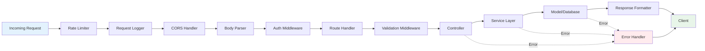

---

## Frontend Architecture

### Component Architecture

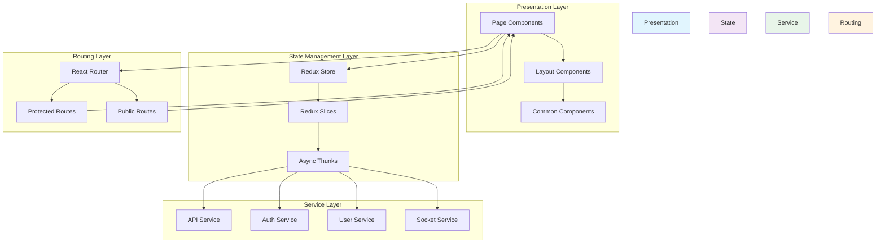

### Frontend Directory Structure

```
frontend/
├── src/
│   ├── index.jsx              # Application entry point
│   │                          # - React rendering
│   │                          # - Redux Provider
│   │                          # - Router setup
│   │
│   ├── App.jsx                # Root component
│   │                          # - Main routing
│   │                          # - Layout structure
│   │                          # - Global providers
│   │
│   ├── components/            # Reusable components
│   │   ├── auth/              # Authentication components
│   │   │   ├── ProtectedRoute.jsx  # - Route guard for authenticated users
│   │   │   └── PublicRoute.jsx     # - Route guard for public pages
│   │   │
│   │   └── common/            # Common UI components
│   │       ├── Button.jsx     # - Reusable button component
│   │       ├── Input.jsx      # - Form input component
│   │       ├── Header.jsx     # - App header/navbar
│   │       ├── Footer.jsx     # - App footer
│   │       ├── LoadingSpinner.jsx  # - Loading indicator
│   │       └── Notifications.jsx   # - Toast notifications
│   │
│   ├── pages/                 # Page-level components
│   │   ├── HomePage.jsx       # - Landing page
│   │   ├── LoginPage.jsx      # - Login form
│   │   ├── RegisterPage.jsx   # - Registration form
│   │   ├── DashboardPage.jsx  # - User dashboard
│   │   ├── ProfilePage.jsx    # - User profile
│   │   └── NotFoundPage.jsx   # - 404 error page
│   │
│   ├── layouts/               # Layout components
│   │   ├── MainLayout.jsx     # - Main app layout (header + content + footer)
│   │   └── AuthLayout.jsx     # - Authentication pages layout
│   │
│   ├── store/                 # Redux state management
│   │   ├── index.js           # - Store configuration
│   │   │                      # - Middleware setup
│   │   │                      # - DevTools integration
│   │   │
│   │   └── slices/            # Redux slices
│   │       ├── authSlice.js   # - Authentication state
│   │       │                  # - Login/logout actions
│   │       │                  # - Token management
│   │       ├── userSlice.js   # - User profile state
│   │       │                  # - User CRUD operations
│   │       └── uiSlice.js     # - UI state (modals, notifications)
│   │                          # - Loading states
│   │
│   ├── services/              # API service layer
│   │   ├── api.js             # - Axios configuration
│   │   │                      # - Request interceptors
│   │   │                      # - Response interceptors
│   │   │                      # - Error handling
│   │   ├── authService.js     # - Auth API calls
│   │   │                      # - Login/register/logout
│   │   ├── userService.js     # - User API calls
│   │   │                      # - Profile management
│   │   └── socketService.js   # - WebSocket client
│   │                          # - Real-time events
│   │
│   ├── styles/                # Global styles
│   │   └── index.css          # - CSS custom properties
│   │                          # - Utility classes
│   │                          # - Global styles
│   │
│   └── __tests__/             # Component tests
│       ├── Button.test.jsx    # - Button component tests
│       └── Input.test.jsx     # - Input component tests
│
└── public/
    ├── index.html             # HTML template
    │                          # - Meta tags
    │                          # - PWA manifest
    └── manifest.json          # PWA configuration
```

### React Component Lifecycle

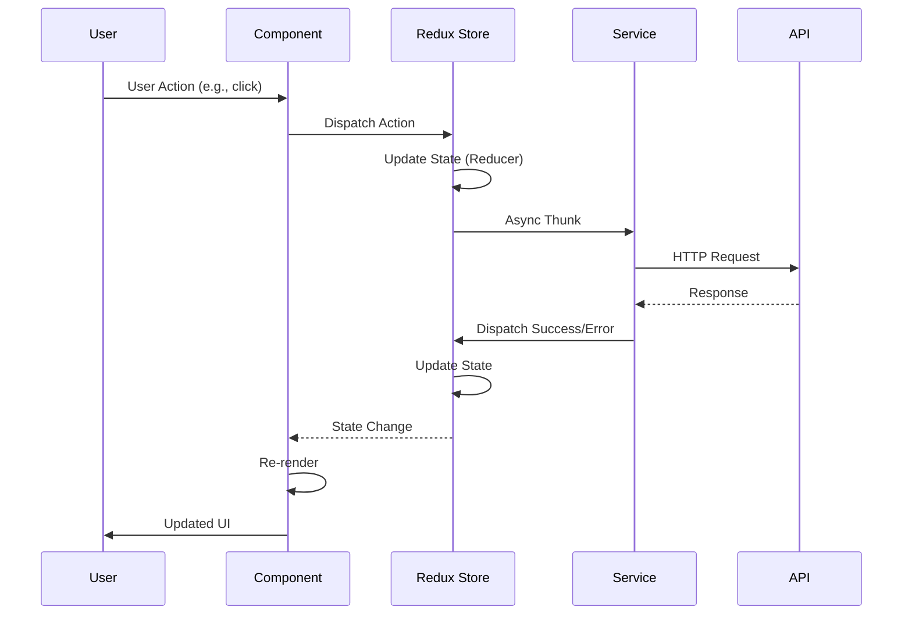

### State Management Flow

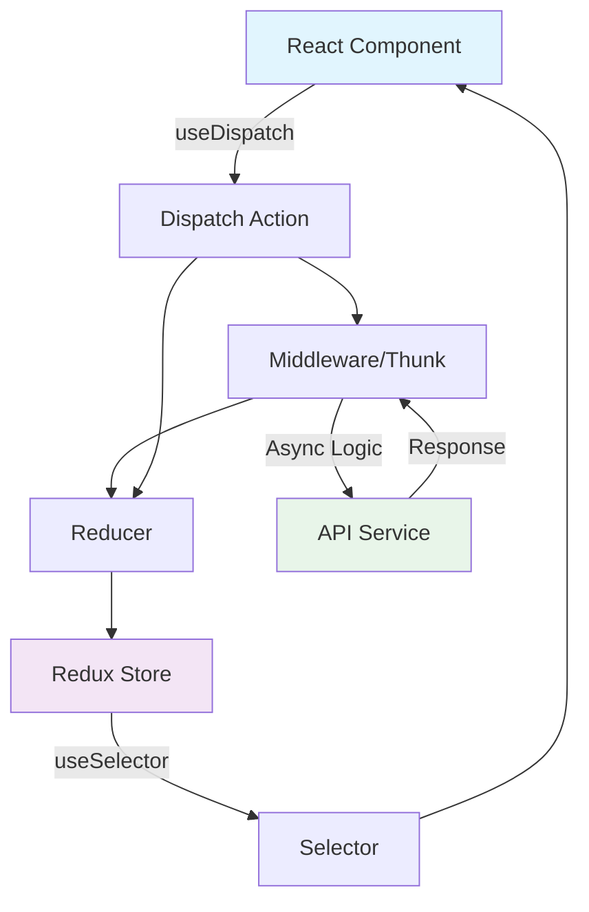

---

## Technology Stack

### Backend Technologies

#### 1. **Node.js** (v18+)

**Purpose**: JavaScript runtime environment for server-side execution.

**Why Node.js?**
- **Non-blocking I/O**: Perfect for handling concurrent connections
- **Same Language**: JavaScript on both frontend and backend
- **NPM Ecosystem**: Largest package ecosystem
- **Performance**: V8 engine provides excellent performance
- **Scalability**: Easy horizontal scaling with clustering

**Use Cases in Project**:
- HTTP server
- WebSocket server
- Async operations
- File system operations

---

#### 2. **Express.js** (v4.x)

**Purpose**: Minimal and flexible web application framework.

**Why Express?**
- **Simplicity**: Easy to learn and use
- **Middleware**: Powerful middleware system
- **Routing**: Flexible routing mechanism
- **Community**: Large community and extensive documentation
- **Performance**: Lightweight and fast

**Key Features Used**:
```javascript
// Middleware chain
app.use(cors());
app.use(helmet());
app.use(express.json());

// Routing
app.use('/api/auth', authRoutes);
app.use('/api/users', userRoutes);

// Error handling
app.use(errorHandler);
```

---

#### 3. **MongoDB** with **Mongoose** (v8.x)

**Purpose**: NoSQL database with ODM (Object Data Modeling).

**Why MongoDB?**
- **Flexible Schema**: Easy to evolve data models
- **JSON-like Documents**: Natural fit for JavaScript/Node.js
- **Scalability**: Horizontal scaling with sharding
- **Performance**: Fast read/write operations
- **Aggregation**: Powerful query capabilities

**Why Mongoose?**
- **Schema Validation**: Data validation at application level
- **Middleware**: Pre/post hooks for business logic
- **Type Casting**: Automatic type conversion
- **Query Building**: Chainable query API
- **Population**: Easy document references

**Example Schema**:
```javascript
const userSchema = new mongoose.Schema({
  email: {
    type: String,
    required: true,
    unique: true,
    lowercase: true
  },
  password: {
    type: String,
    required: true,
    select: false  // Don't include in queries by default
  }
}, {
  timestamps: true,  // Auto createdAt/updatedAt
  toJSON: { virtuals: true }  // Include virtual fields
});

// Pre-save hook
userSchema.pre('save', async function(next) {
  if (this.isModified('password')) {
    this.password = await bcrypt.hash(this.password, 12);
  }
  next();
});
```

---

#### 4. **JWT (JSON Web Tokens)**

**Purpose**: Stateless authentication mechanism.

**Why JWT?**
- **Stateless**: No server-side session storage needed
- **Scalable**: Easy to scale horizontally
- **Cross-Domain**: Works across different domains
- **Mobile-Friendly**: Perfect for mobile apps
- **Compact**: Small payload size

**Architecture**:
```javascript
// Access Token (short-lived: 7 days)
{
  id: user._id,
  email: user.email,
  role: user.role,
  exp: 7 days
}

// Refresh Token (long-lived: 30 days)
{
  id: user._id,
  exp: 30 days
}
```

**Security Measures**:
- Tokens signed with secret key
- Short expiration for access tokens
- Refresh token rotation
- Token blacklisting support
- HTTPOnly cookies option

---

#### 5. **Socket.IO** (v4.x)

**Purpose**: Real-time bidirectional event-based communication.

**Why Socket.IO?**
- **Real-Time**: Instant communication
- **Fallback**: Automatic fallback to long-polling
- **Rooms**: Easy group communication
- **Binary**: Support for binary data
- **Reliability**: Automatic reconnection

**Use Cases**:
- Live notifications
- Chat functionality
- Real-time updates
- Collaborative editing
- Live dashboards

**Implementation**:
```javascript
// Server
io.on('connection', (socket) => {
  socket.on('message', (data) => {
    io.to(room).emit('message', data);
  });
});

// Client
socket.emit('message', { text: 'Hello' });
socket.on('message', (data) => {
  console.log(data);
});
```

---

#### 6. **Joi** (Validation)

**Purpose**: Schema description and data validation.

**Why Joi?**
- **Expressive**: Readable validation schemas
- **Comprehensive**: Covers all data types
- **Async Support**: Async validation rules
- **Error Messages**: Detailed error descriptions
- **Type Coercion**: Automatic type conversion

**Example**:
```javascript
const registerSchema = Joi.object({
  email: Joi.string().email().required(),
  password: Joi.string().min(8).required(),
  firstName: Joi.string().min(2).max(50).required(),
  lastName: Joi.string().min(2).max(50).required()
});
```

---

#### 7. **Bcrypt**

**Purpose**: Password hashing and verification.

**Why Bcrypt?**
- **Security**: Industry-standard algorithm
- **Salt**: Automatic salt generation
- **Configurable**: Adjustable complexity
- **Slow**: Intentionally slow to prevent brute-force
- **Future-Proof**: Complexity can be increased over time

**Usage**:
```javascript
// Hashing
const hashedPassword = await bcrypt.hash(password, 12);

// Verification
const isValid = await bcrypt.compare(candidatePassword, hashedPassword);
```

---

#### 8. **Security Middleware**

##### **Helmet**
- Sets secure HTTP headers
- Prevents common vulnerabilities
- XSS protection
- Content Security Policy

##### **CORS**
- Cross-Origin Resource Sharing
- Configurable origins
- Credentials support

##### **Express Rate Limit**
- Rate limiting
- DDoS protection
- Configurable windows
- Custom handlers

---

### Frontend Technologies

#### 1. **React** (v18.x)

**Purpose**: Component-based UI library.

**Why React?**
- **Component Reusability**: Build once, use everywhere
- **Virtual DOM**: Efficient rendering
- **Hooks**: Powerful state and lifecycle management
- **Ecosystem**: Huge ecosystem of libraries
- **Community**: Large community and support
- **Performance**: Optimized reconciliation algorithm

**Key Concepts Used**:
```javascript
// Functional Components
const MyComponent = () => {
  return <div>Hello</div>;
};

// Hooks
const [state, setState] = useState(initial);
useEffect(() => { /* side effects */ }, [deps]);
const navigate = useNavigate();
const dispatch = useDispatch();
const data = useSelector(selectData);
```

**Component Types**:
- **Presentational**: Pure UI components
- **Container**: Connected to state
- **Page**: Full-page components
- **Layout**: Structural components

---

#### 2. **Redux Toolkit** (v2.x)

**Purpose**: State management with less boilerplate.

**Why Redux Toolkit?**
- **Less Boilerplate**: Simplified Redux setup
- **Immer Integration**: Immutable updates made easy
- **DevTools**: Built-in Redux DevTools
- **Best Practices**: Enforces Redux best practices
- **TypeScript**: Excellent TypeScript support

**Architecture**:
```javascript
// Slice (combines reducer + actions)
const authSlice = createSlice({
  name: 'auth',
  initialState,
  reducers: {
    setUser: (state, action) => {
      state.user = action.payload;  // Immer handles immutability
    }
  },
  extraReducers: (builder) => {
    builder
      .addCase(login.pending, (state) => {
        state.loading = true;
      })
      .addCase(login.fulfilled, (state, action) => {
        state.user = action.payload;
        state.loading = false;
      });
  }
});

// Async Thunk
const login = createAsyncThunk(
  'auth/login',
  async (credentials) => {
    const response = await authService.login(credentials);
    return response.data;
  }
);
```

**State Structure**:
```javascript
{
  auth: {
    user: null,
    token: null,
    loading: false,
    error: null
  },
  users: {
    list: [],
    current: null,
    loading: false
  },
  ui: {
    notifications: [],
    theme: 'light',
    sidebarOpen: true
  }
}
```

---

#### 3. **React Router** (v6.x)

**Purpose**: Client-side routing for SPA.

**Why React Router?**
- **Declarative**: Component-based routing
- **Dynamic**: Runtime route changes
- **Nested Routes**: Hierarchical routing
- **Code Splitting**: Lazy loading support
- **Hooks**: useNavigate, useParams, useLocation

**Routing Structure**:
```javascript
<Routes>
  <Route path="/" element={<MainLayout />}>
    <Route index element={<HomePage />} />
    <Route path="login" element={<PublicRoute><LoginPage /></PublicRoute>} />
    <Route path="dashboard" element={<ProtectedRoute><DashboardPage /></ProtectedRoute>} />
  </Route>
</Routes>
```

**Route Guards**:
- **ProtectedRoute**: Requires authentication
- **PublicRoute**: Redirects if authenticated
- **RoleRoute**: Role-based access control

---

#### 4. **Axios**

**Purpose**: Promise-based HTTP client.

**Why Axios?**
- **Interceptors**: Request/response middleware
- **Cancellation**: Request cancellation support
- **Timeouts**: Built-in timeout handling
- **Transforms**: Automatic JSON transformation
- **Browser/Node**: Works in both environments

**Configuration**:
```javascript
// API instance with interceptors
const api = axios.create({
  baseURL: process.env.REACT_APP_API_URL,
  timeout: 10000
});

// Request interceptor (add auth token)
api.interceptors.request.use((config) => {
  const token = localStorage.getItem('accessToken');
  if (token) {
    config.headers.Authorization = `Bearer ${token}`;
  }
  return config;
});

// Response interceptor (handle errors)
api.interceptors.response.use(
  (response) => response,
  async (error) => {
    if (error.response?.status === 401) {
      // Refresh token logic
    }
    return Promise.reject(error);
  }
);
```

---

#### 5. **CSS Architecture**

**Purpose**: Styling with CSS custom properties and utility classes.

**Why This Approach?**
- **Native CSS**: No additional dependencies
- **Custom Properties**: Dynamic theming
- **Utility Classes**: Rapid development
- **Responsive**: Mobile-first design
- **Performance**: No CSS-in-JS overhead

**Structure**:
```css
:root {
  /* Colors */
  --primary: #4f46e5;
  --secondary: #ec4899;
  
  /* Spacing */
  --space-1: 0.25rem;
  --space-2: 0.5rem;
  
  /* Typography */
  --font-base: 1rem;
  --font-lg: 1.25rem;
}

/* Utility classes */
.flex { display: flex; }
.gap-4 { gap: var(--space-4); }
.text-primary { color: var(--primary); }
```

---

### Testing Technologies

#### 1. **Jest** (Backend)

**Purpose**: JavaScript testing framework.

**Features**:
- Snapshot testing
- Mock functions
- Code coverage
- Parallel execution
- Watch mode

---

#### 2. **React Testing Library** (Frontend)

**Purpose**: User-centric component testing.

**Philosophy**:
- Test user behavior, not implementation
- Query by accessibility attributes
- No shallow rendering

---

#### 3. **Playwright** (E2E)

**Purpose**: End-to-end browser testing.

**Features**:
- Cross-browser testing
- Auto-wait mechanism
- Parallel execution
- Video recording
- Network interception
- Mobile emulation

**Architecture**:
```javascript
// Page Object Model
class LoginPage {
  constructor(page) {
    this.page = page;
    this.emailInput = page.getByLabel('Email');
    this.submitButton = page.getByRole('button', { name: /login/i });
  }
  
  async login(email, password) {
    await this.emailInput.fill(email);
    await this.submitButton.click();
  }
}

// Test
test('should login', async ({ page }) => {
  const loginPage = new LoginPage(page);
  await loginPage.login('user@example.com', 'password');
  await expect(page).toHaveURL(/dashboard/);
});
```

---

## Data Flow

### Complete Request-Response Flow

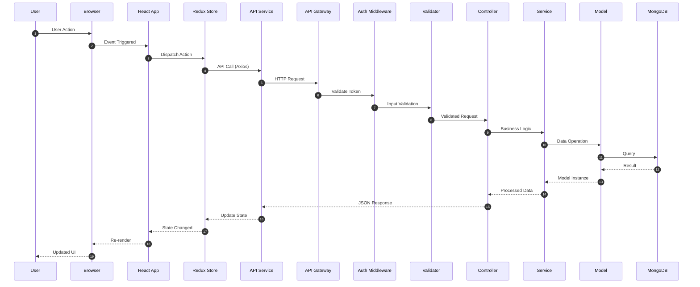

### Authentication Flow

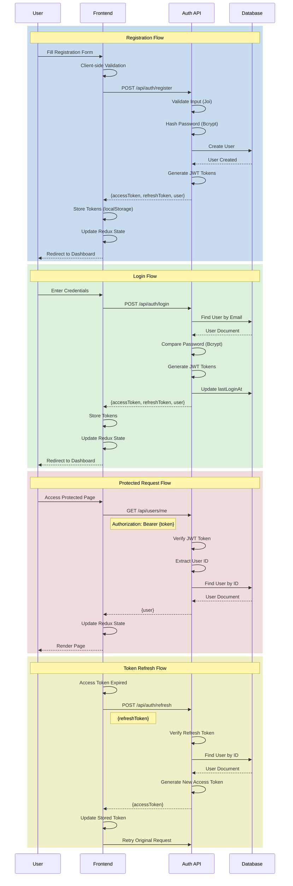

### WebSocket Communication Flow

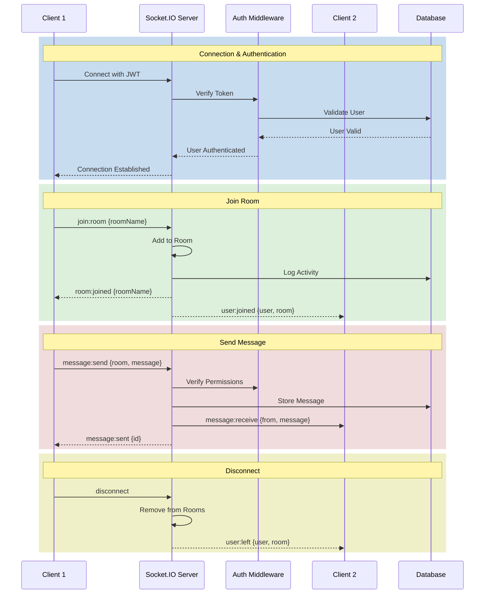

---

## Security Architecture

### Security Layers

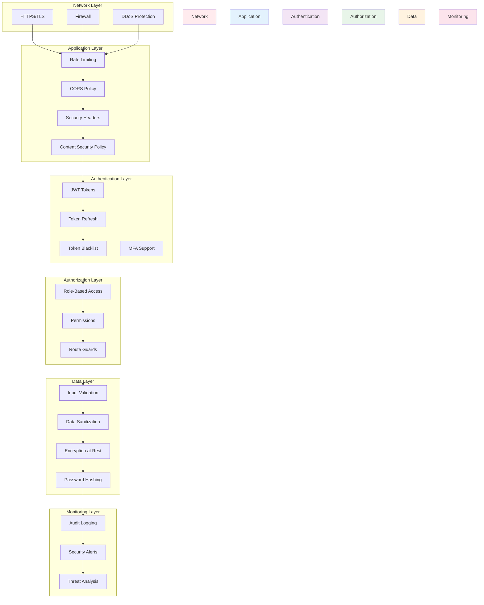

### Security Best Practices Implemented

#### 1. **Password Security**
```javascript
// Bcrypt with 12 rounds (configurable)
const salt = await bcrypt.genSalt(12);
const hashedPassword = await bcrypt.hash(password, salt);

// Minimum 8 characters, complexity requirements
const passwordSchema = Joi.string()
  .min(8)
  .pattern(/^(?=.*[a-z])(?=.*[A-Z])(?=.*\d)/)
  .required();
```

#### 2. **JWT Security**
```javascript
// Short-lived access tokens
accessToken: { expiresIn: '7d' }

// Long-lived refresh tokens
refreshToken: { expiresIn: '30d' }

// Token rotation on refresh
// Blacklist support for logout
```

#### 3. **Input Validation**
```javascript
// Joi schema validation
const schema = Joi.object({
  email: Joi.string().email().required(),
  age: Joi.number().min(18).max(120)
});

// MongoDB query sanitization
// XSS protection through escaping
```

#### 4. **Rate Limiting**
```javascript
// Global rate limit: 100 requests per 15 minutes
const apiLimiter = rateLimit({
  windowMs: 15 * 60 * 1000,
  max: 100
});

// Auth rate limit: 10 attempts per 15 minutes
const authLimiter = rateLimit({
  windowMs: 15 * 60 * 1000,
  max: 10
});
```

#### 5. **CORS Configuration**
```javascript
const corsOptions = {
  origin: process.env.CORS_ORIGIN,
  credentials: true,
  optionsSuccessStatus: 200
};
```

#### 6. **Security Headers (Helmet)**
```javascript
// X-Frame-Options: Prevent clickjacking
// X-Content-Type-Options: Prevent MIME sniffing
// X-XSS-Protection: XSS filter
// Strict-Transport-Security: Enforce HTTPS
// Content-Security-Policy: Control resource loading
```

---

## Design Patterns

### 1. **MVC Pattern** (Backend)

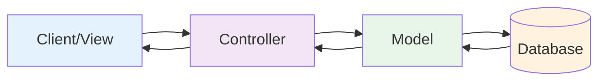

**Implementation**:
- **Model**: Mongoose schemas (data structure + business logic)
- **View**: React frontend (presentation layer)
- **Controller**: Express route handlers (request/response handling)

### 2. **Repository Pattern**

```javascript
// Abstraction layer for data access
class UserRepository {
  async findById(id) {
    return User.findById(id);
  }
  
  async create(userData) {
    const user = new User(userData);
    return user.save();
  }
  
  async update(id, updates) {
    return User.findByIdAndUpdate(id, updates, { new: true });
  }
}
```

### 3. **Service Layer Pattern**

```javascript
// Business logic separated from controllers
class UserService {
  constructor(userRepository) {
    this.userRepository = userRepository;
  }
  
  async createUser(userData) {
    // Validation
    // Business logic
    // Call repository
    return this.userRepository.create(userData);
  }
}
```

### 4. **Middleware Pattern** (Chain of Responsibility)

```javascript
// Sequential processing pipeline
app.use(cors());
app.use(helmet());
app.use(express.json());
app.use(rateLimiter);
app.use(requestLogger);
app.use(authMiddleware);
```

### 5. **Factory Pattern**

```javascript
// Token factory
class TokenFactory {
  static createAccessToken(payload) {
    return jwt.sign(payload, config.jwtSecret, {
      expiresIn: config.jwtExpiresIn
    });
  }
  
  static createRefreshToken(payload) {
    return jwt.sign(payload, config.jwtRefreshSecret, {
      expiresIn: config.jwtRefreshExpiresIn
    });
  }
}
```

### 6. **Observer Pattern** (Redux)

```javascript
// State changes trigger component updates
const Component = () => {
  const user = useSelector(state => state.auth.user);
  // Component re-renders when user changes
};
```

### 7. **Singleton Pattern**

```javascript
// Database connection
let connection = null;

export const connectDatabase = async () => {
  if (connection) return connection;
  connection = await mongoose.connect(uri);
  return connection;
};
```

### 8. **Strategy Pattern**

```javascript
// Different authentication strategies
const authStrategies = {
  jwt: new JWTStrategy(),
  oauth: new OAuthStrategy(),
  local: new LocalStrategy()
};

const authenticate = (strategy) => {
  return authStrategies[strategy].authenticate();
};
```

---

## Deployment Architecture

### Container Architecture

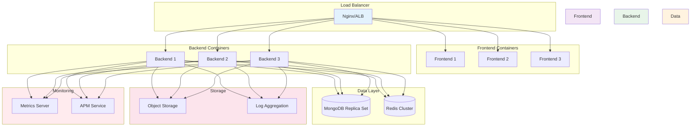

### Scaling Strategy

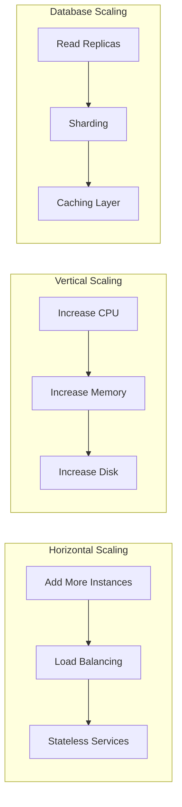

### CI/CD Pipeline

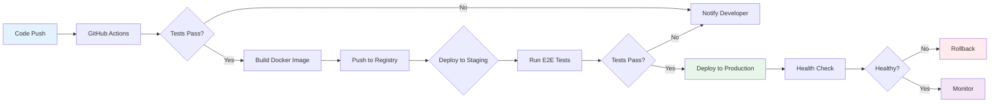

---

## Performance Optimization

### 1. **Backend Optimizations**
- Database indexing
- Query optimization
- Connection pooling
- Caching with Redis
- Compression (gzip)
- CDN for static assets

### 2. **Frontend Optimizations**
- Code splitting
- Lazy loading
- Image optimization
- Bundle size optimization
- Service Worker/PWA
- Memoization (React.memo, useMemo)

### 3. **Network Optimizations**
- HTTP/2
- Keep-Alive connections
- Resource hints (preload, prefetch)
- WebSocket for real-time

---

## Monitoring and Observability

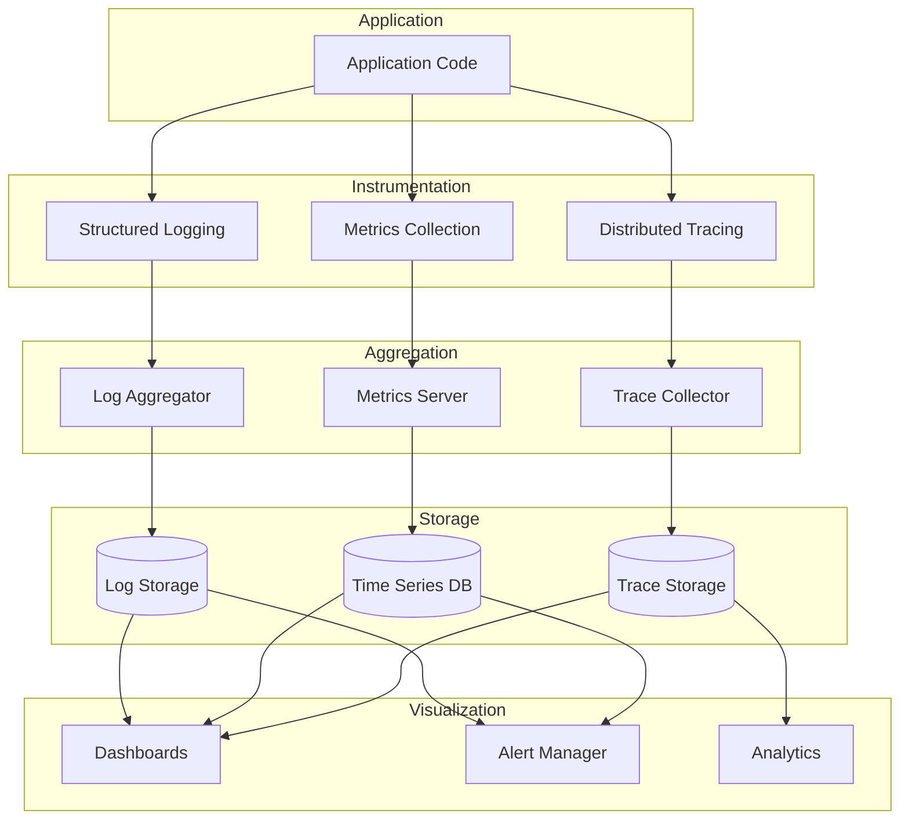

---

## Conclusion

This architecture provides:

- **Scalability**: Horizontal and vertical scaling capabilities
- **Maintainability**: Clear separation of concerns and modular design
- **Security**: Multiple layers of security controls
- **Performance**: Optimized for speed and efficiency
- **Testability**: Comprehensive testing at all levels
- **Developer Experience**: Modern tooling and best practices
- **Production Ready**: Monitoring, logging, and error handling

The template is designed to be a starting point that can be extended and customized based on specific project requirements while maintaining these core architectural principles.
